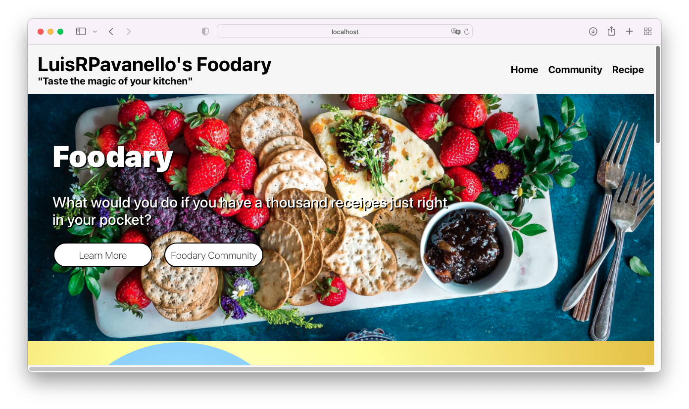

# Foodary - A Recipe Sharing Platform

Welcome to the Foodary project! In this tutorial, you will learn how to build a fully functioning multi-page application called Foodary, a platform where the food community can share their favorite recipes online. This project will help you apply the knowledge you've gained from previous tutorials on React, including understanding state lifecycles, state management, and page navigation with React Router.

## Video Introduction

<div aling=center>[Link Preview Video](https://www.youtube.com/watch?v=CdeIExkuJUw)</div>


## Table of Contents

- [Tutorial Introduction](#tutorial-introduction)
- [Learning Outcomes](#learning-outcomes)
- [Prerequisites](#prerequisites)
- [Getting Started](#getting-started)
- [Project Overview](#project-overview)
- [Usage](#usage)
- [Contributing](#contributing)
- [License](#license)

## Tutorial Introduction

In the earlier tutorials, you learned about React state lifecycles and how to change state, as well as how to navigate between various pages using React Router. In this tutorial, we will combine these skills to build a simple website that captures the essential layouts and elements of modern web applications. We will utilize CSS's "display: flex" property to create clean and scalable layouts for our web pages.

## Learning Outcomes

By completing this tutorial, you will be able to:

- Build a fully functioning multi-page application using React.
- Create reusable components to efficiently structure your application.
- Effectively implement page navigation and indexing to enhance user experience.

## Prerequisites

Before starting this tutorial, it is assumed that you have some prior knowledge of HTML, as you will need to understand the HTML elements used in this website. If you are not familiar with HTML, we recommend learning about it before proceeding.

## Getting Started

To get started with the Foodary project, follow these steps:

1. Clone this repository to your local machine:

   ```bash
   git clone https://github.com/luisrpavanelli/food-community-project
   ```

2. Navigate to the project directory:

   ```bash
   cd foodary-community-project
   ```

3. Install the required dependencies:

   ```bash
   npm install
   ```

4. Start the development server:

   ```bash
   npm start
   ```

Now you're ready to explore and build upon the Foodary project!

## Project Overview

Foodary is a platform for food enthusiasts to share and discover delicious recipes. It incorporates key features and concepts you've learned in previous tutorials, such as managing application state, creating reusable components, and implementing page navigation.

In this project, you will create various components to represent different parts of the application, such as recipe listings, recipe details, and user profiles. You will also implement a navigation system using React Router to allow users to seamlessly navigate between different sections of the app.

## Usage

Feel free to use and modify this project as a learning resource or as a starting point for your own recipe sharing platform. Be sure to refer to the video mentioned in the introduction for a more detailed understanding of the project requirements.

## Contributing

We welcome contributions to the Foodary project. If you have any improvements, bug fixes, or new features to suggest, please open an issue or create a pull request. Your contributions will help make this project even better!

## License

This project is licensed under the MIT License.
